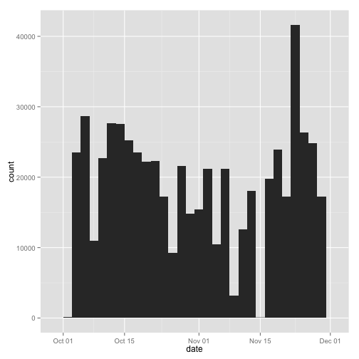

# Reproducible Research: Peer Assessment 1


## Loading and preprocessing the data

Download, extract and store the data in the **activity** data frame. Also transform the date field to `Date` format and print a sample of values to understand the data.


```r
fileUrl <- "https://d396qusza40orc.cloudfront.net/repdata%2Fdata%2Factivity.zip"
download.file(fileUrl, destfile = "Dataset.zip", method = "curl")
unzip("Dataset.zip")
activity <- read.csv("./activity.csv")
activity$date <- as.Date(activity$date)
head(activity)
```

```
##   steps       date interval
## 1    NA 2012-10-01        0
## 2    NA 2012-10-01        5
## 3    NA 2012-10-01       10
## 4    NA 2012-10-01       15
## 5    NA 2012-10-01       20
## 6    NA 2012-10-01       25
```


## What is mean total number of steps taken per day?

A histogram of the total number of steps taken **each** day is calculated and shown below:


```r
library(ggplot2)
q <- qplot(date, weight = activity$steps, data = activity, geom = "histogram")
print(q)
```

```
## stat_bin: binwidth defaulted to range/30. Use 'binwidth = x' to adjust this.
```

 


Calculation of the mean and median total number of steps taken **per** day:


```r
mean(tapply(activity$steps, activity$date, sum, na.rm = TRUE))
```

```
## [1] 9354
```

```r
median(tapply(activity$steps, activity$date, sum, na.rm = TRUE))
```

```
## [1] 10395
```


## What is the average daily activity pattern?


## Imputing missing values


## Are there differences in activity patterns between weekdays and weekends?
